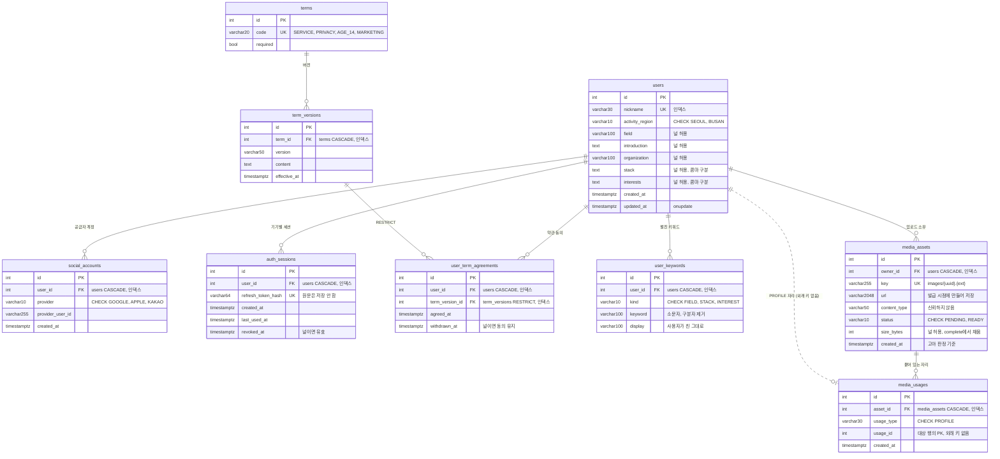

# 데이터베이스 스키마

표 10개짜리 PostgreSQL 하나가 전부다. 캐시(Redis)와 이미지 원본(S3)은 여기 없다.

**원본은 `app/*/model.py`다.** 이 문서는 읽기용 스냅샷이라 손으로 고치면 어긋난다. 모델과 마이그레이션 사이 드리프트는 `uv run alembic check`가 잡는다.



점선은 **외래 키가 없는 참조**다. `media_usages.usage_id`는 대상 표가 여럿이라 제약을 걸 수 없다. 근거는 [프로필 이미지와 키워드 자동완성](../complete/profile-media-and-keywords.md)의 「사용처 표」에 있다.

## 표

| 표 | 무엇 | 모델 | 마이그레이션 |
|---|---|---|---|
| `users` | 가입한 사람. 프로필 원본 | `app/users/model.py:10` | `20260803_0001` |
| `social_accounts` | 공급자별 계정 연결 | `app/auth/model.py:9` | `20260803_0001` |
| `auth_sessions` | 기기별 refresh 세션 | `app/auth/model.py:23` | `20260803_0001` |
| `terms` | 약관 종류와 필수 여부 | `app/terms/model.py:9` | `20260803_0001` |
| `term_versions` | 약관 본문의 버전 | `app/terms/model.py:17` | `20260803_0001` |
| `user_term_agreements` | 누가 어느 버전에 동의했는지 | `app/terms/model.py:28` | `20260803_0001` |
| `media_assets` | 업로드된 이미지 한 장 | `app/images/model.py:13` | `20260809_0003` |
| `media_usages` | 그 이미지가 붙어 있는 자리 | `app/images/model.py:29` | `20260813_0004` |
| `user_keywords` | 자동완성 집계의 원천 | `app/keywords/model.py:7` | `20260809_0003` |

약관 시드는 `20260808_0002`가 넣는다.

## 유니크 제약

`(컬럼)` 하나로 끝나지 않는 것들이다. 이게 각 표의 실질적인 정체성이다.

| 제약 | 표 | 뜻 |
|---|---|---|
| `uq_social_accounts_provider_user` | `social_accounts` | 공급자 계정 하나는 사용자 한 명에게만 |
| `uq_term_versions_term_version` | `term_versions` | 약관당 버전 문자열 중복 불가 |
| `uq_media_usages_slot` | `media_usages` | **자리당 이미지 한 장** |
| `uq_user_keywords_user_kind_keyword` | `user_keywords` | 한 사람이 같은 키워드를 여러 번 세지 못함 |

`uq_media_usages_slot` 때문에 프로필 사진 교체가 UPDATE가 아니라 delete-then-insert다 (`app/users/service.py:19-21`). 여러 장을 붙이는 사용처가 생기면 푸는 마이그레이션이 필요하다.

`uq_user_keywords_user_kind_keyword`가 자동완성의 "서로 다른 사용자 5명" 기준을 성립시킨다. 행이 사용자당 하나라 `count(*)`가 곧 사용자 수다.

## 삭제 전파

사용자 하나를 지우면 어디까지 따라가는지가 이 스키마에서 제일 자주 헷갈리는 부분이다.

```
users 삭제
├─▶ social_accounts, auth_sessions, user_keywords   CASCADE
├─▶ user_term_agreements                             CASCADE
└─▶ media_assets                                     CASCADE
      └─▶ media_usages                               CASCADE
```

## 여기 없는 것

**가입 코드는 표가 아니라 Redis에 있다.** 키 `signup:v1:{코드의 SHA-256}`, 값 `provider:sub`, TTL은 `AUTH_LOGIN_CODE_TTL_SECONDS`다. 60초짜리 일회용이라 만료를 TTL에 맡기면 정리 배치도 만료 컬럼도 필요 없다. 없어져도 앱이 소셜 로그인을 다시 하면 새로 생기므로 PostgreSQL에 사본을 두지 않는다. 근거는 [아키텍처 결정](../decisions/architecture.md)에, 흐름은 [소셜 인증](../complete/social-auth.md)에 있다.

`media_usages`는 `asset_id` 한 방향으로만 지워진다. `usage_id` 쪽은 외래 키가 없어서 **대상이 사라져도 행이 남는다.** 지금은 본인 소유 에셋만 붙일 수 있어 사용자 삭제가 위 경로로 결국 함께 지우므로 구멍이 실제로 열리지 않는다. 남의 에셋을 가리키는 사용처(행사 포스터 등)가 생기면 그때 열린다.

`user_term_agreements → term_versions`만 `RESTRICT`다. 사람이 동의한 약관 버전은 지울 수 없다. 동의 철회는 삭제가 아니라 `withdrawn_at`을 채우는 것이다.

## SQLite로 테스트할 때

기본 테스트는 인메모리 SQLite에서 돈다. **두 가지를 켜지 않으면 스키마가 실제로 검증되지 않는다.**

- `PRAGMA foreign_keys = ON` — 꺼져 있으면 `ON DELETE CASCADE`가 조용히 무시된다
- `PRAGMA case_sensitive_like = ON` — `LIKE`가 기본 대소문자 무시라 키워드 정규화가 빠져도 통과한다

픽스처가 둘 다 켠다. PostgreSQL로 돌리려면 `TEST_DATABASE_URL`을 준다. 자세한 것은 [프로필 이미지와 키워드 자동완성](../complete/profile-media-and-keywords.md)의 「검증 결과」에 있다.

## 아직 없는 것

`docs/plan/events.md`의 행사 기능이 들어오면 표가 늘고 `media_usages`의 `CHECK`에 `EVENT_POSTER`가 추가된다. `CHECK` 문자열은 `app/images/model.py:10`의 `USAGE_TYPES` 상수에서 생성되므로 **상수만 고치면 DB 제약은 그대로다.** 마이그레이션이 함께 필요하다.
