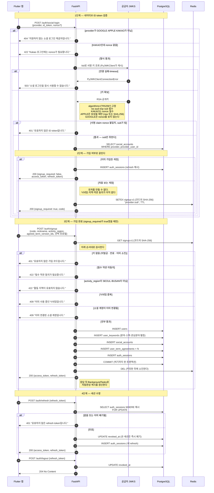

# 소셜 인증

Google·Apple·Kakao 네이티브 ID token 방식의 인증 계약과 검증 결과를 기록한다.

## 경계

- 앱이 공급자 인증을 끝내고 API에 **ID token**을 보낸다. API는 검증된 `sub`만 계정 식별자로 쓴다.
- 공급자 access/refresh token·이메일·이름은 **저장하지도 로그에 남기지도 않는다.** Apple이 최초 승인 응답에만 주는 이름·이메일도 받지 않는다.
- **플랫폼 차이는 앱에서 끝낸다.** iOS든 Android든 같은 `POST /auth/social-login`에 같은 provider의 ID token을 보낸다. API는 provider별 검증만 하고 OS·SDK·리다이렉트 방식으로 분기하지 않는다.
- 웹은 폐기했다. OAuth 콜백 엔드포인트를 만들지 않는다. Apple Android의 return URL은 앱 복귀용으로만 쓰고 API는 관여하지 않는다.

## API 계약

| API | 역할 |
|---|---|
| `POST /auth/social-login` | 네이티브 공급자 ID token 검증·로그인 시작 |
| `POST /auth/signup`, `refresh`, `logout` | 가입·세션 |
| `GET/PATCH /me` | 프로필 |
| `PUT /me/marketing-consent` | 마케팅 수신 동의 |

```json
POST /auth/social-login
{"provider": "GOOGLE|APPLE|KAKAO", "id_token": "공급자 JWT", "nonce": "선택"}
```

가입 완료 계정은 `{"signup_required": false, "access_token": "...", "refresh_token": "...", "token_type": "bearer"}`, 첫 로그인은 `{"signup_required": true, "code": "..."}`를 받는다.

핵심 모델: `users`(이메일 미저장, 닉네임 유일), `social_accounts`(공급자·외부 ID 유일), `auth_sessions`(refresh 해시), 약관·약관 버전·동의 이력. 표 구성은 [데이터베이스 스키마](../architecture/schema.md)에 있다.

## 로그인·가입 흐름



**가입 코드는 "이 소셜 계정을 검증했다"는 짧은 수명의 영수증이다.** ID token 검증은 1단계에서 이미 끝났는데 유저를 만들 수 없어서, 앱이 가입 화면을 띄우는 동안 그 결과를 붙들어 둘 자리가 필요하다. 그래서 `signup`은 ID token을 다시 검증하지 않는다 — **코드를 아는 것이 곧 그 소셜 계정의 증명이다.** 코드 원문은 어디에도 저장하지 않고 SHA-256을 키로 쓴다. 수명은 `AUTH_LOGIN_CODE_TTL_SECONDS`로 주입하며 기본값이 없어 미설정이면 기동이 실패한다.

**코드는 표가 아니라 Redis에 있다.** 키 `signup:v1:{코드의 SHA-256}`, 값 `provider:sub`. 표로 두면 만료 행을 지우는 배치를 따로 만들어야 하는데, 60초짜리 일회용에 TTL이 정확히 그 일을 한다. `expires_at`·`used_at` 컬럼과 만료 검사가 통째로 사라지고 **미발급·만료·이미 소진이 "키가 없다" 하나로 합쳐진다.** Redis가 죽으면 새 가입이 막히지만 잃을 데이터는 없다 — 앱이 소셜 로그인을 다시 하면 새 코드가 나온다. 판단 근거는 [아키텍처 결정](../decisions/architecture.md)에 있다.

**소진은 DB를 커밋한 뒤에 한다.** 먼저 지우면 커밋이 실패했을 때 코드만 날아가 사용자가 소셜 로그인부터 다시 해야 한다. 순서를 뒤집은 대가로 두 가지가 따라온다. 하나는 **검증에서 막힌 요청이 코드를 소진하지 않는다는 것** — 닉네임이 중복이라 409를 받으면 닉네임만 고쳐 같은 코드로 다시 시도할 수 있다. 의도한 동작이라 테스트로 고정해 뒀다. 다른 하나는 `DEL`이 실패하면 코드가 TTL까지 남는다는 것인데, 그 코드로 다시 가입해도 `uq_social_accounts_provider_user`가 막아 계정이 둘 생기지 않는다.

웹 OAuth 시절에는 기존 유저용 로그인 코드를 `POST /auth/token`으로 교환하는 경로가 따로 있었고 그래서 `user_id` 컬럼이 있었지만, 웹을 폐기하면서 그 코드를 만드는 쪽이 사라져 엔드포인트와 함께 걷어냈다. 지금 코드를 소비하는 곳은 `/auth/signup` 하나뿐이다.

refresh token은 **쓸 때마다 교체한다.** 쓴 세션은 그 자리에서 `revoked_at`이 찍히므로 같은 refresh token으로 두 번 발급받을 수 없다. 로그아웃도 같은 컬럼을 채우는 것이라 세션 폐기 경로가 하나다.

## 공급자별 검증과 운영 설정

| | Google | Apple | Kakao |
|---|---|---|---|
| **앱** | Google Identity Services. backend용 **Web client ID**를 server client ID로 지정해 ID token을 받는다 | iOS는 AuthenticationServices 네이티브. Android는 Apple 웹 인증을 Custom Tab으로 열고 HTTPS return URL로 복귀 | Kakao SDK. 카카오톡 로그인 시도 후 카카오계정으로 폴백. **OIDC를 켜야** ID token이 나온다 |
| **`iss`** | `accounts.google.com` 또는 `https://accounts.google.com` | `https://appleid.apple.com` | `https://kauth.kakao.com` |
| **`aud`** | 허용 Web client ID 목록 | iOS bundle ID 또는 Android Service ID | Native app key |
| **nonce** | **보지 않는다** | 앱이 보냈을 때만. raw와 SHA-256 둘 다 받는다 | **필수** |
| **환경 변수** | `GOOGLE_OAUTH_CLIENT_IDS` | `APPLE_CLIENT_IDS` (쉼표 구분) | `KAKAO_NATIVE_APP_KEY` |
| **콘솔 등록** | Android package+SHA-1, iOS bundle ID, Web client ID를 한 프로젝트에 | App ID에 capability, iOS bundle ID, Android용 Service ID·도메인·return URL | Android package+key hash, iOS bundle ID, Kakao Login, OpenID Connect |

셋 다 JWKS 조회 → `RS256` 고정 → `iss`·`aud`·`exp`·`sub` 검증은 같다. 다른 것은 위 세 줄뿐이다.

nonce 취급이 갈리는 이유: Kakao와 Apple은 공식 문서가 nonce 검증을 요구하고, **Google은 서명·`aud`·`iss`·`exp`까지만 요구해서 그대로 따랐다.** 앱이 Google에 nonce를 보내도 서버는 확인하지 않는다.

- [Google backend authentication guide](https://developers.google.com/identity/sign-in/android/backend-auth)
- [Apple identity token guide](https://developer.apple.com/documentation/signinwithapple/receiving-a-users-identity-token)
- [Kakao OIDC guide](https://developers.kakao.com/docs/en/kakaologin/utilize)

## 구현 체크리스트

- [x] 설정, 모델·마이그레이션
- [x] 프로필·약관 API
- [x] 토큰·세션 (refresh 회전, logout 폐기)
- [x] 웹 인가 경로·코드 제거 (`authorize`·`callback`, `OAuthAttempt`, `CallbackSettings`)
- [x] 세 공급자 ID token 검증 (JWKS·`RS256`·issuer·audience·만료·`sub`, Kakao 필수 nonce, Apple 선택 nonce)
- [x] 첫 로그인 가입 코드 / 기존 계정 토큰 발급
- [x] `cryptography` 의존성과 RSA 서명 JWT 테스트

## 검증 결과

전체 스위트 42개 통과. 인증 관련 테스트가 확인하는 것:

- 세 공급자 각각 유효 JWT로 로그인이 되고, 가입 여부에 따라 가입 코드와 토큰으로 갈린다
- Google은 잘못된 audience를 401로 거절한다
- Apple·Kakao는 nonce 불일치를 401로 거절한다
- 가입 후 refresh 회전이 동작한다
- 필수 약관 누락과 만료된 코드를 거절한다

## 남은 검증

**API 코드로는 더 확인할 수 없고 실제 자격 증명과 기기가 있어야 한다.**

- [ ] 세 공급자 콘솔 등록을 마치고 환경 변수를 배포 환경에 주입
- [ ] Android·iOS 실기기에서 Google·Apple·Kakao 로그인 각각 확인
- [ ] Apple Android 웹 인증의 취소·return URL·앱 복귀를 별도 확인
- [ ] Flutter가 공급자 access/refresh token과 Apple 최초 이름·이메일을 API에 보내지도 앱에 영속 저장하지도 않는지 확인
- [ ] Flutter가 Mogakco refresh token을 OS 보안 저장소에 보관하는지 확인

테스트로 아직 안 덮은 것:

- [ ] 잘못된 서명·알고리즘, `iss`, `exp`, 빈 `sub`를 **세 공급자 전부에서** 401로 거절
- [ ] JWKS timeout·5xx를 503으로, 알 수 없는 `kid`를 한 번 새로 읽은 뒤에도 없으면 401로 처리
- [ ] 가입 코드 재사용을 401로 거절

콘솔 설정과 Flutter 구현은 이 저장소 밖의 작업이다.

참조: [인증 결정](../decisions/authentication.md).
