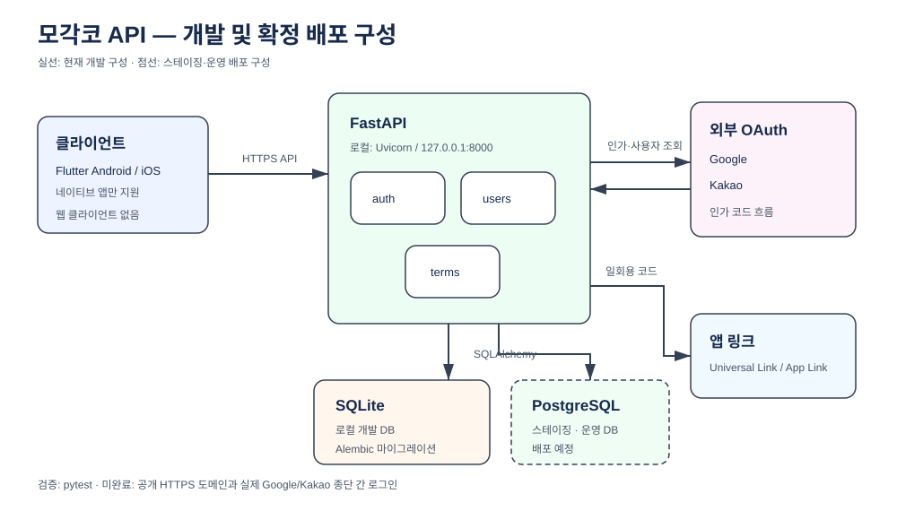

# 아키텍처 결정

편집 원본: [`current.drawio`](../architecture/current.drawio)

클라이언트는 Flutter로 만드는 Android·iOS 앱뿐이다. 웹은 폐기했으므로 브라우저 전용 대응(CORS, 쿠키 기반 세션, 웹 리다이렉트 콜백)은 두지 않는다.

기능 중심 모듈러 모놀리스로 구현한다. 기능별 `router.py`는 HTTP, `service.py`는 규칙, `schemas.py`는 API 변환을 맡는다. ORM 모델을 응답에 직접 노출하지 않는다.

일반 CRUD에는 헥사고날 아키텍처나 `repository.py`를 추가하지 않는다. 외부 연동 교체·복잡한 상태 규칙·격리 테스트가 실제로 필요할 때만 포트, 어댑터, 저장소를 둔다. `common/`은 실제 공유 코드만 둔다.

표 구성과 삭제 전파는 [데이터베이스 스키마](../architecture/schema.md)에 있다.

지속되어야 하는 데이터는 PostgreSQL 하나에 둔다. S3에는 이미지 원본이 있고, Redis에는 두 가지가 들어간다.

- **사본** — 자동완성 집계. 원본은 `user_keywords`다. Redis가 죽으면 PostgreSQL에서 다시 집계해 답하므로 기능이 멈추지 않는다 ([자동완성 캐시 운영](../operations/keyword-cache.md)).
- **되살릴 수 있는 원본** — 가입 코드. PostgreSQL에 사본이 없으므로 Redis가 죽으면 새 가입이 막힌다. 대신 **잃을 데이터가 없다.** 앱이 소셜 로그인을 다시 하면 새 코드가 나오고, 사용자가 이미 끝낸 일이 사라지지 않는다.

기준은 "Redis에 원본을 두지 않는다"가 아니라 **"Redis가 비워졌을 때 사용자가 같은 행동을 다시 해서 원상복구되는가"**다. 가입 코드는 60초짜리 일회용이라 여기 해당한다. 되지 않는 것 — 계정, 프로필, 약관 동의, 이미지 참조 — 은 PostgreSQL에 둔다.

가입 코드를 Redis에 둔 이유는 **TTL이 만료를 대신 처리하기 때문이다.** 표로 두면 만료 행이 영영 쌓이거나 정리 배치를 따로 만들어야 한다. 그 대가로 `REDIS_URL`이 선택이 아니라 필수가 됐다.
